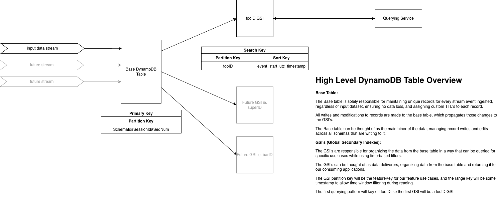
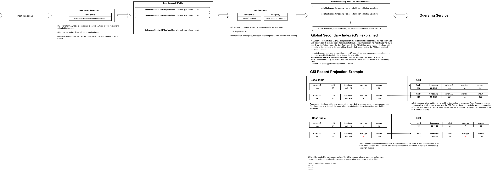

# Using GSI's to support flexible querying requirements on high-volume datasets

Here I designed a dynamoDB table with GSI's (Global Secondary Indexes) to enable multiple read patterns on the table while maintaining the uniqueness of each record in the table.

In this first high-level diagram we can see some important points about the database. On the input side of things, we see that the database supports different input streams, the first of which sees volumes of 30M+ events daily. The only common schema the input streams must share (technically) are the 3 fields that make up the primary key for the base table. The combination of these 3 fields is guaranteed unique for all events across all input data streams. 

However, this primary key is not meant to be read from, as it doesn't mean anything to the systems that are reading from the table. To support reads, we create a GSI with a partition key matching the desired read pattern (in this case fooID), and a range/sort key that allows the ready pattern to filter events based on a time window. 

^ This design falls into the broader category of architectural patterns that you may recognize: CQRS (Command Query Responsibility Segregation)

note: LSI's (local secondary indexes) were also reviewed, but were quickly ruled out as they must have the same partition key as the base table, violating a fundamental concept of this architectural pattern

Below is a diagram I made explaining how GSI's work in the context of our design to a technical audience. A GSI's is essentially a projection of the data in the base table, where we choose field(s) to use as the new partition key for the read pattern, as well as a sort key. When creating the GSI, we have the option to select columns from the base table to carry over, with the constraint that columns used in the search key of the table must be part of that selection. 

We can see that duplicate search keys in the GSI are allowed, because these rows in the GSI are just projections of the real data in the base table, and are linked. So a change to a row in the base table will propagate (in an eventually consistent manner) to the linked row in the GSI. 

A few cost considerations with GSI's (as they work in AWS DynamoDB) -> 
- write and storage costs increase 
  - whatever you write to the GSI incurs cost just like a write to the base table
  - If you choose to project every field to the GSI you can consider your write cost to approximately double
- Read's are 1/2 the cost of the base table 
  - This is because we are performing eventually consistent reads on the GSI
- 

