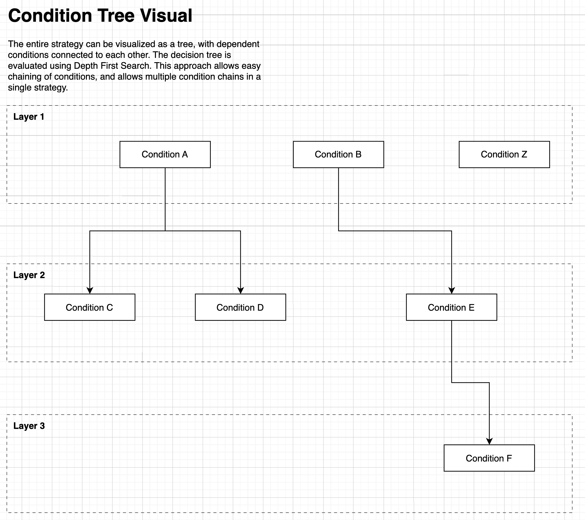
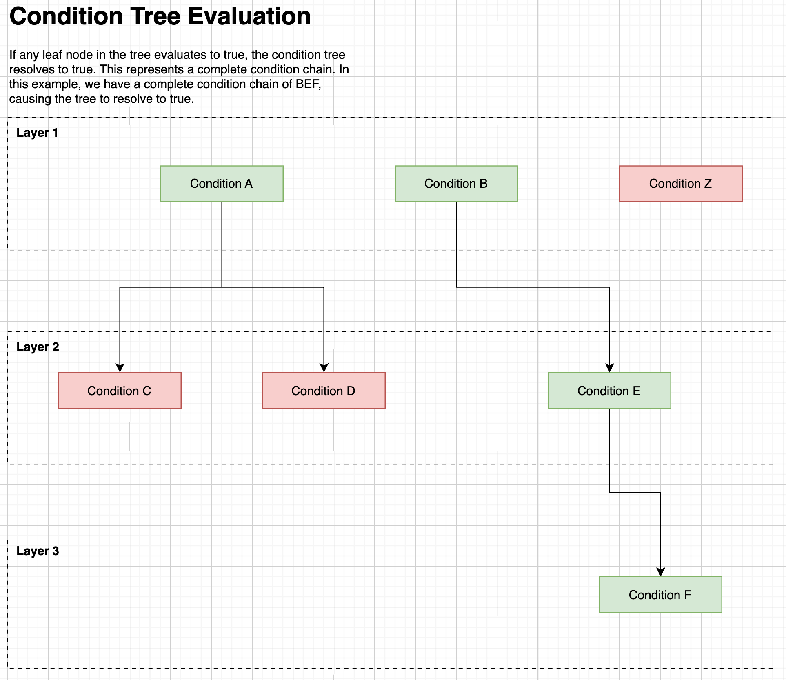
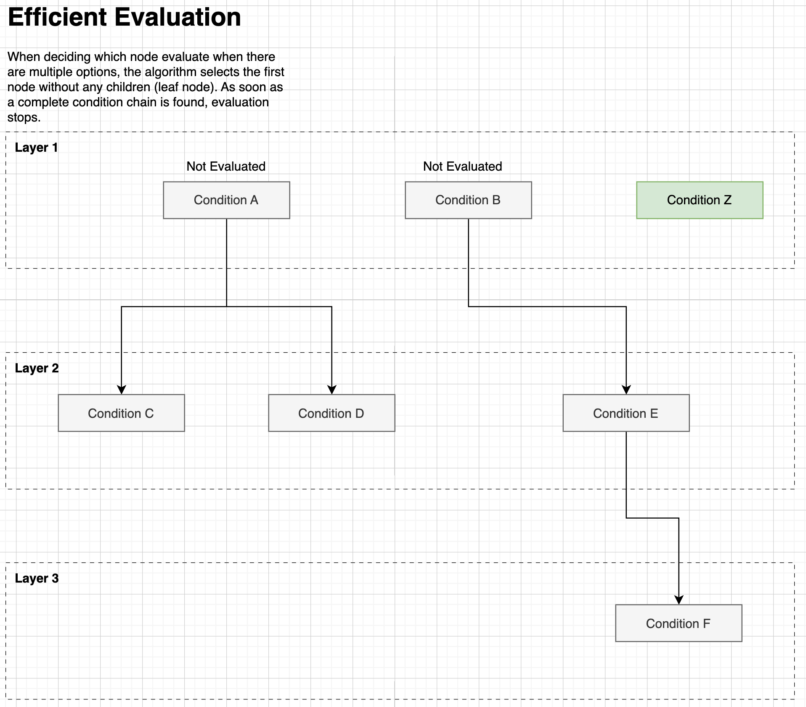

# Creating a Flexible and intuitive strategy evaluation process 

To execute an actual trading strategy the bot needs a method to evaluate multiple conditions that may or may not depend on each other. 

For example: 

- Buy stock IF 200ema shows uptrend in stock AND MACD cross in positive direction 
- Buy stock IF stock price closes below 52 week low OR stock price closes under 200ema

### The core idea: Condition Trees

At the heart of the trading platform is the strategy creation and decision making process. I strove to create a system that would be easily understandable and also cover all use cases under a single algorithm. 

The AND/OR relationship between individual conditions lends itself to a tree structure, where we can consider conditions that depend on each other as connected in the tree, and conditions that do not depend each other as separate legs of the tree. 

The simple idea is that if all conditions in a chain evaluate to true, the condition tree should resolve to true. A simple strategy might just include a single leg: 


A -> B -> C, where if A, B, and C are true, then we buy for example 


But we can also branch out at any node, even the first one, to accommodate additional logical condition chains in our strategy: 


A -> B -> C\
D -> E

^ where if ABC are all true OR DE are all true then we buy for example

Some diagrams discussing how it works: 

***

***

***


### Strategy Configuration Example 

Below we have an example of a json strategy template. This template is parsed at runtime and contains information about which indicators to calculate, the ticker, condition trees, and what actions to take if the condition trees evaluate to true. 

**Section Descriptions**

**Flows**
- There can be any number of flows in a strategy
- Each Flow has a start condition, id, and a steps section
  - start **condition** (condition met on the data to start evaluating this flow)
    - in this example, the start condition for each flow is whether or not we have an open position
  - **id** identifier for logs
  - **steps** this section is list of actions connected with condition trees. Each flow can have multiple steps, so potentially multiple actions taken on a financial instrument based on many conditions.
    - **id** identifier for logs 
    - **actions** what actions to take if condition tree evaluates to true
    - **condition_tree** This is the actual condition tree, each layer is a list of conditions, and each condition can have 0,1, or more children conditions, which follow the same format to create the tree structure
      - **name** name of condition function for logs
      - **function** name of function in code
      - **options** options to configure function
      - **children** list of dependent conditions to this one (AND condition)


```
{
    "name" : "testing template",
    "df_template" : ["t","o","h","l","c","v","200ema","50ema","20ema"],
    "worker_functions" : ["wf.calc_200EMAv3","wf.calc_50EMAv3", "wf.calc_20EMAv3","wf.calc_MACD","wf.calc_MACD_diff200"],
    "tickers": ["AUD_USD"],
    "flows": [
            {
                "id": "entry_flow",
                "start_condition": "signal_info==None",
                "steps":  [
                    {
                        "id": "enter trade",
                        "actions":[
                            {
                                "name": "enter position simple",
                                "function": "enter_position",
                                "options": {}
                            }
                        ],
                        "condition_tree": [
                            {
                                "name": "MACD Cross",
                                "function" : "trends.MACD_differential_cross",
                                "options": {
                                        "search_period": 72,
                                        "min_amplitude": 0.5,
                                        "entry": true
                                    },
                                "children": [
                                    {
                                         "name": "Check 200ema Trend direction",
                                        "function" : "trends.check_trend",
                                        "options": {
                                            "direction": {
                                                "key": "direction"
                                            },
                                            "start": 0,
                                            "end": 288,
                                            "line": "200ema",
                                            "target_angle": 0.01,
                                            "pip_value": 0.0001
                                        },
                                        "children": null
                                    }
                                ]
                            }
                        ]
                    }
                ]
            },
            {
                "id": "exit_flow",
                "start_condition": "signal_info['openTime']!=None",
                "steps":  [
                    {
                        "id": "exit trade",
                        "actions":[
                             {
                            "name": "exit position simple",
                            "function": "exit_position",
                            "options": {}
                        }
                    ],
                        "condition_tree": [
                            {
                                "name": "MACD Cross",
                                "function" : "trends.MACD_differential",
                                "options": {
                                        "min_amplitude": 0.5,
                                        "entry": false
                                    },
                                "children": null
                            }
                        ]
                    }
                ]
            }

    ]

}
```

### "The Brain" Flow/Condition Tree Evaluation Class

See the linked code below for how I implemented the logic described above. "Flows" are based into this class for evaluation 

[strategy evaluation class](./code_samples/brain.py)