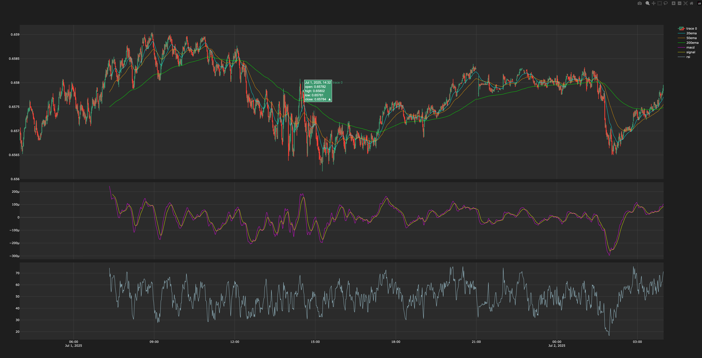

# Creating a re-usable prototyping system for technical indicators 


I wanted an environment where I could run the indicators I designed in python over real Forex data and get real visual feedback on how those indicators looked alongside the candlestick chart. 


The main design principles of the test bed are: 
- don't re-invent the wheel, lean on the existing code to pull candlestick data, manage data, calculate indicators and strategies, etc. 
- generalize and keep customization of python technical indicators and configuration of test runs out of the test bed itself

***

### Code Sample test_bed.py

Looking at the code you'll see that really the only custom implementation for the test bed is the config parsing and the pyplot creation at the end. Everything is designed to use the same code that is used in the actual application. 

Notably, we replace what would be the OANDA API with a mocking service that pulls historical data in bulk, and then behaves like the api would by feeding the TestBed candlesticks one by one during the simulation. 

[test bed class](./code_samples/test_bed.py)


### Json for simple test configuration

Below is a configuration json file for the test bed. Included is information about what indicators to calculate on the data, what ticker, which trading signals to run on the simulation, and finally which indicators to plot after running the simulation. 

```
{
    "name" : "testing template",
    "indicators" : ["ema.calc_ema(h, 200)","ema.calc_ema(h, 50)", "ema.calc_ema(h, 20)","macd.calc_MACD(h)", "rsi.calc_rsi(h)"],
    "graph":[
         {"column": "20ema", "subplot": 1},
         {"column": "50ema", "subplot": 1},
         {"column": "200ema", "subplot": 1},
         {"column": "macd", "subplot": 2},
         {"column": "signal", "subplot": 2},
         {"column": "rsi", "subplot": 3}
    ],
    "tickers": ["AUD_USD"],
    "flows": [
         {
                "id": "test signal generation",
                "start_condition": "signal_info==None",
                "steps":  [
                    {
                        "id": "test signal generation",
                        "actions":[
                            {
                                "name": "test signal",
                                "function": "nothing",
                                "options": {}
                            }
                        ],
                        "condition_tree": [
                            {
                                "name": "rsi above 70",
                                "function" : "value.check_value",
                                "options": {
                                        "direction": "above",
                                        "indicator": "rsi",
                                        "value": 70 
                                    },
                                "children": null 
                            }
                        ]
                    }
                ]
            }
    ]
}

```


***


Below we see an example run of the test bed using the above configuration, over a few days in July 2025, we calculate MACD and RSI (as implemented in my python indicators collection) and display them in subplots alongside the candlestick chart, which you can see has 20,50,and 200ema. 




