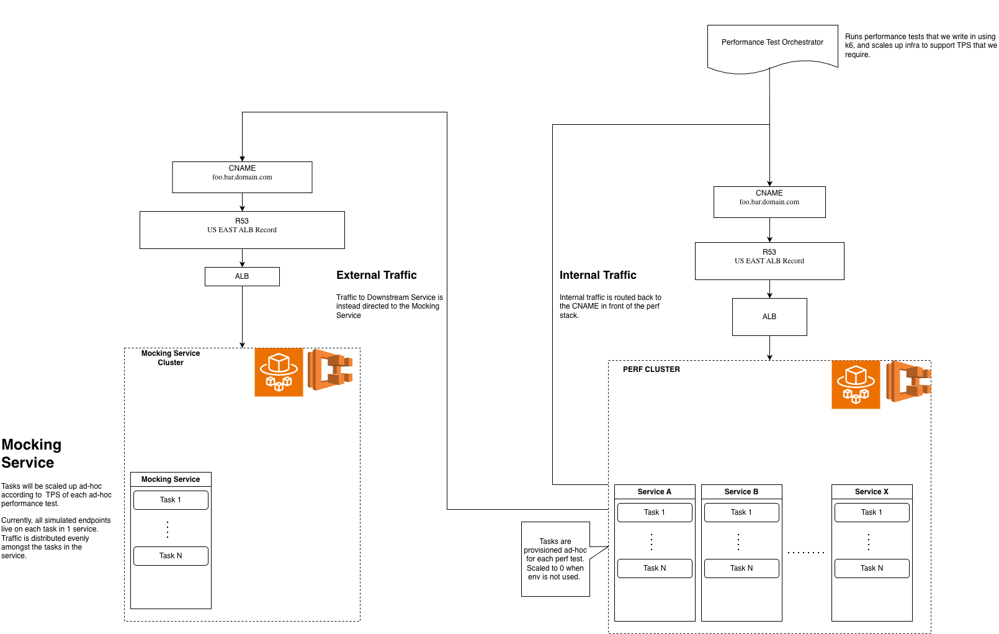

# Reliable Performance Testing for Distributed Systems

The most major consideration for this performance testing environment was the mocking service. The System being tested had a workflow that was dependent on the data passed back from downstream services while processing the request. Each Downstream service was mocked on tasks in the Mocking ECS Cluster, and provided a response designed to illicit the desired flow in the application. Many downstream interactions had to be mocked, but the configuration proved to be re-usable after initial setup. 

To take this design further, one might consider some proper isolation of the services inside the Mocking ECS Cluster. Currently, all mocked downstream endpoints live on each task in the singular Mocking service. This was simple from a configuraiton standpoint, but leads to natural questions about traffic volumes and scaling needs based on downstream endpoints (some are invoked more than others by the application). Letting the ALB route using Last Outstanding Requests worked fine in this case, and it was decided not to sink time into over-optimizing an ephemeral environment. 

All performance environment configurations were set up at the configuration and infrastructure level. This common-sense de-coupling of performance environment configurations and application code give us a few key benefits: 

- Easily provision performance environment with no custom set-up
- Test the application exactly as how it will be deployed
- Easily maintain configurations
- Scale the performance environment up and down easily 

